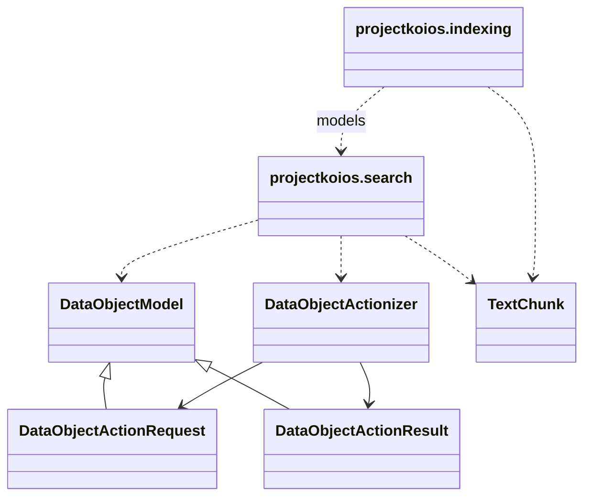

# `projectkoios` namespace implementation

The package is distributed as a namespace package from `src/python`. This
repository implements Search-owned modules while the `projectkoios` dependency
supplies shared thin base objects and existing chunking records.

Implementation modules import shared boundaries from their owning modules.
`projectkoios.search` and `projectkoios.indexing` use explicit initializers;
the namespace root itself has no initializer or implementation behavior.
