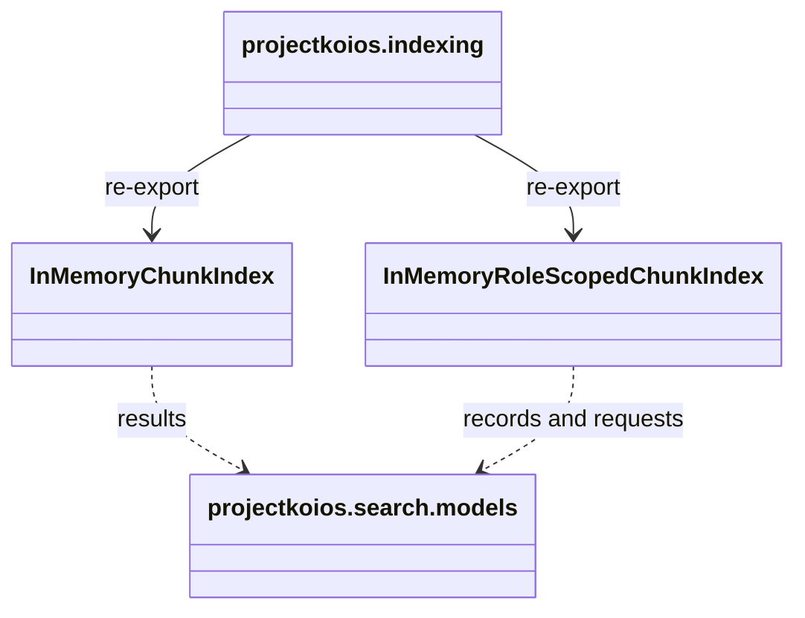

# `projectkoios.indexing` package implementation

The initializer explicitly re-exports `InMemoryChunkIndex` and
`InMemoryRoleScopedChunkIndex`. Both implementations retain their indexed
records in process memory and perform no persistence or network I/O.

The role-scoped index requires an explicit admission policy. The simpler chunk
index has no role or purpose boundary and remains a distinct prototype.
