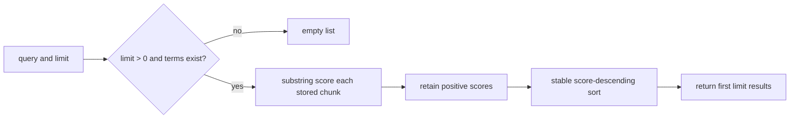

# `in_memory_chunk_index` implementation

`add_chunks` appends the supplied iterable to an in-memory list. Search lowercases
and whitespace-splits the query, then scores each chunk by counting query-term
entries that occur as substrings of the lowercased chunk text.

A non-positive limit, empty query, or query without whitespace-delimited terms
returns an empty list. Equal-score results retain insertion order because the
score-only descending sort is stable. This module does not apply corpus-role or
purpose admission.
