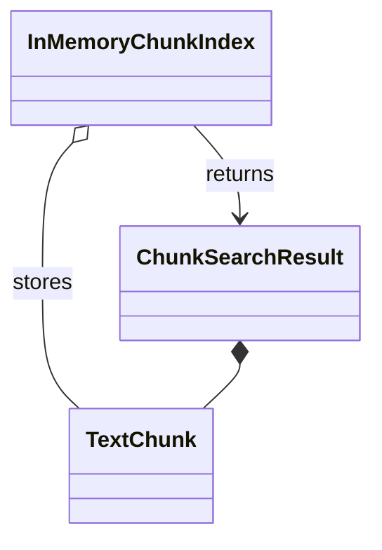

# `in_memory_chunk_index` schematic

```mermaid
classDiagram
    class TextChunk
    class ChunkSearchResult
    class InMemoryChunkIndex

    InMemoryChunkIndex o-- TextChunk : stores
    InMemoryChunkIndex --> ChunkSearchResult : returns
    ChunkSearchResult *-- TextChunk
```

The implementation accepts existing `TextChunk` objects and wraps matching
objects in search-owned `ChunkSearchResult` records.
