# `in_memory_role_scoped_index` implementation

The index requires a `RoleAdmissionPolicy` at construction and stores records by
`record_id`. `add_records` rejects duplicate identities within a batch and
collisions with stored records.

```mermaid
flowchart LR
    Request["RoleScopedSearchRequest"] --> Roles["resolve policy-admitted roles"]
    Roles --> Admit["filter role, record purpose, exclusions"]
    Admit --> Terms["tokenize admitted records"]
    Terms --> BM25["BM25 k1=1.2, b=0.75"]
    BM25 --> Positive["retain positive scores"]
    Positive --> Order["score descending, record_id ascending"]
    Order --> Rank["limit and assign one-based ranks"]
```

Tokenization case-folds text and recognizes alphanumeric terms with optional
internal full stops or hyphens. Query terms are deduplicated in first-seen
order. Document frequency and average document length are computed only over
admitted, non-excluded records. Unsupported policy purposes propagate the
policy's fail-closed error.
