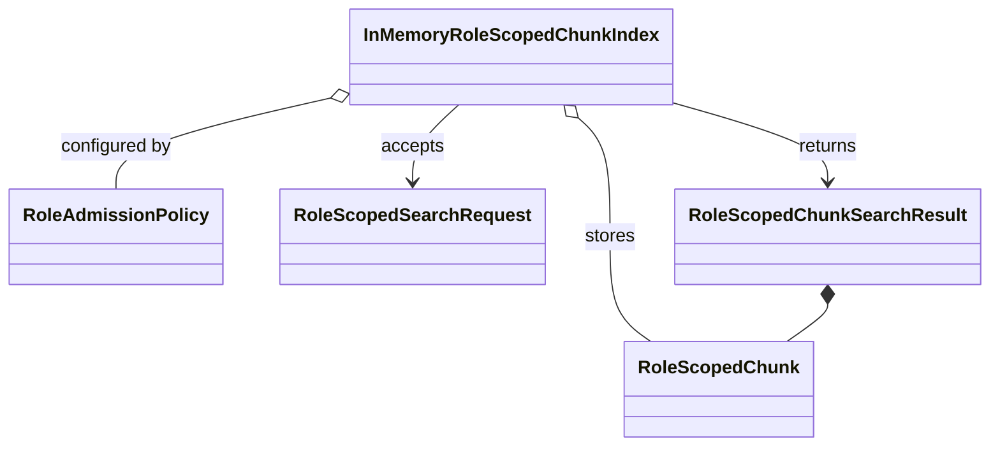

# `in_memory_role_scoped_index` schematic

```mermaid
classDiagram
    class RoleAdmissionPolicy
    class RoleScopedChunk
    class RoleScopedSearchRequest
    class RoleScopedChunkSearchResult
    class InMemoryRoleScopedChunkIndex

    InMemoryRoleScopedChunkIndex o-- RoleAdmissionPolicy : configured by
    InMemoryRoleScopedChunkIndex o-- RoleScopedChunk : stores
    InMemoryRoleScopedChunkIndex --> RoleScopedSearchRequest : accepts
    InMemoryRoleScopedChunkIndex --> RoleScopedChunkSearchResult : returns
    RoleScopedChunkSearchResult *-- RoleScopedChunk
```

Both policy-level corpus-role admission and record-level purpose admission must
succeed before a record can be scored.
