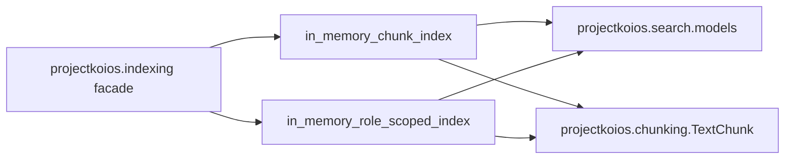

# `projectkoios.indexing` package schematic

```mermaid
flowchart LR
    Facade["projectkoios.indexing facade"] --> Chunk["in_memory_chunk_index"]
    Facade --> Scoped["in_memory_role_scoped_index"]
    Chunk --> SearchModels["projectkoios.search.models"]
    Scoped --> SearchModels
    Chunk --> TextChunk["projectkoios.chunking.TextChunk"]
    Scoped --> TextChunk
```

The package provides implementations for search-owned result and request
boundaries without moving those boundaries into the indexing package.
