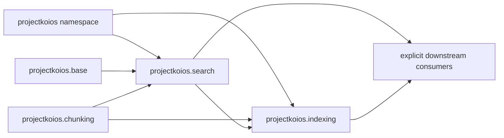

# `projectkoios` namespace schematic

`projectkoios.base` and `projectkoios.chunking` are shared dependency-owned
boundaries. This repository's indexing implementations consume Search-owned
models while both package facades remain explicit. Neither package acquires
product authority from the namespace.
