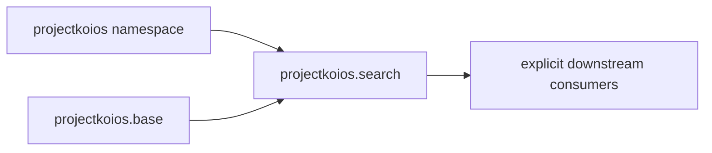

# `projectkoios` namespace schematic

```mermaid
flowchart LR
    Namespace["projectkoios namespace"] --> Search["projectkoios.search"]
    Core["projectkoios.base"] --> Search
    Search --> Consumers["explicit downstream consumers"]
```

`projectkoios.base` supplies the thin DataObject and DataObjectActionizer
boundaries. Search does not acquire product authority from the namespace.
