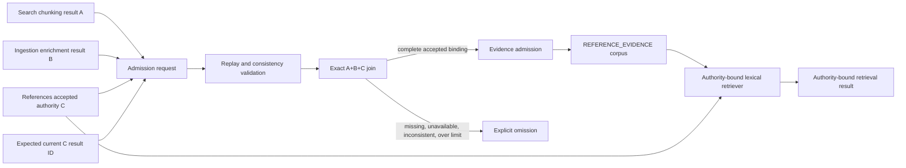

# Authority-bound evidence schematic

```mermaid
flowchart LR
    A[Search chunking result A] --> Q[Admission request]
    B[Ingestion enrichment result B] --> Q
    C[References accepted authority C] --> Q
    E[Expected current C result ID] --> Q
    Q --> V[Replay and consistency validation]
    V --> J[Exact A+B+C join]
    J -->|complete accepted binding| I[Evidence admission]
    J -->|missing, unavailable, inconsistent, over limit| O[Explicit omission]
    I --> P[REFERENCE_EVIDENCE corpus]
    P --> R[Authority-bound lexical retriever]
    C --> R
    R --> X[Authority-bound retrieval result]
```

The expected authority result ID is supplied by the References checkpoint owner.
A self-consistent historical projection does not satisfy a newer checkpoint.
