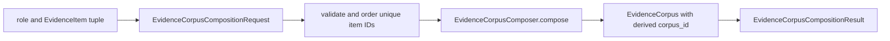
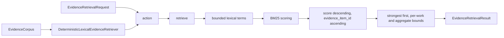

# `evidence_retrieval` implementation

## Corpus composition

`EvidenceCorpusCompositionRequest` validates the admitted role and exact item
set, rejects duplicate item identities, and canonicalizes items by ascending
`evidence_item_id`. `EvidenceCorpusComposer.action(*, request)` delegates
directly to `compose(*, request)`, which creates the immutable `EvidenceCorpus`
and bound `EvidenceCorpusCompositionResult`.



The corpus admits only `REFERENCE_EVIDENCE`. Its identity binds that role and
the canonical item identity manifest, so tuple input order cannot change corpus
identity and callers cannot inject a corpus ID.

## Retrieval action path

`DeterministicLexicalEvidenceRetriever` accepts one exact `EvidenceCorpus`.
Its `action(*, request)` delegates directly
to `retrieve(*, request)`. There is one retrieval implementation path.



## BM25 baseline

The retriever case-folds text and applies the module's Unicode lexical pattern.
Repeated query terms are removed while retaining first occurrence order. For
term `t` and document `d`, the score is:

```text
IDF(t) = ln(1 + (N - n_t + 0.5) / (n_t + 0.5))

BM25(d, q) = sum over t in q of
  IDF(t) * f(t,d) * (k1 + 1)
  / (f(t,d) + k1 * (1 - b + b * |d| / avgdl))
```

The fixed parameters are `k1 = 1.2` and `b = 0.75`. Document frequency and
average length are computed over evidence eligible under the request's work
filters. Scores are ranking evidence, not probabilities or support judgments.

The formula follows Stephen Robertson and Hugo Zaragoza, “The Probabilistic
Relevance Framework: BM25 and Beyond,” *Foundations and Trends in Information
Retrieval* 3(4), 2009, DOI `10.1561/1500000019`.

## Deterministic selection

Candidates with positive scores are ordered by descending score and then by
`evidence_item_id`. Selection retains the strongest eligible item and continues
in that order under the result, per-bibliographic-work, and aggregate-text
limits. Missing required works stop substitution. The result records exclusive
omission counts and contiguous selected ranks.

## Deterministic identities

| Object | Init-false field | Identity binds |
|---|---|---|
| `EvidenceWarning` | `warning_id` | warning type, code, and detail |
| `EvidenceItem` | `evidence_item_id` | source IDs, status, exact representations and digests, warning IDs |
| `EvidenceCorpus` | `corpus_id` | admitted role and canonical unique evidence item IDs |
| `EvidenceCorpusCompositionRequest` | `request_id` | request type, admitted role, and canonical item IDs |
| `EvidenceCorpusCompositionResult` | `result_id` | request ID, composer implementation identity, and corpus ID |
| `EvidenceRetrievalRequest` | `request_id` | purpose, query, opaque target ID, work IDs, and bounds |
| `RankedEvidenceItem` | `ranked_evidence_item_id` | evidence item ID, exact float score, rank, matched terms, and tie key |
| `EvidenceRetrievalResult` | `result_id` | request ID, retriever implementation identity, corpus/index IDs, outcome, ranked IDs, omissions, and warnings |

Each owner exposes `identity_for` and assigns its ID with `field(init=False)` in
`__post_init__`. Caller-supplied IDs are therefore impossible through the public
constructor.

## Bounds and outcomes

The implementation fixes these hard maxima:

| Value | Maximum |
|---|---:|
| Query characters | 2,000 |
| Normalized query terms | 256 |
| Opaque ID characters | 512 |
| Work filters or required works | 32 each |
| Selected items | 50 |
| Selected items per bibliographic work | 10 |
| Indexed text per item | 20,000 characters |
| Retained text per item | 40,000 characters |
| Ordered source spans per item | 32 |
| Warnings per item | 32 |
| Warning code | 128 characters |
| Warning detail | 1,000 characters |
| Aggregate selected text | 100,000 characters |

Requests may select lower result, per-work, and aggregate limits. Values beyond
the hard bounds fail before retrieval.

Outcomes are `EVIDENCE_AVAILABLE`, `INSUFFICIENT_EVIDENCE`, `INVALID_REQUEST`,
and `INFRASTRUCTURE_FAILURE`. Insufficiency is mechanical and is never a
scientific-support judgment. Unexpected defects are not converted to
insufficiency.
