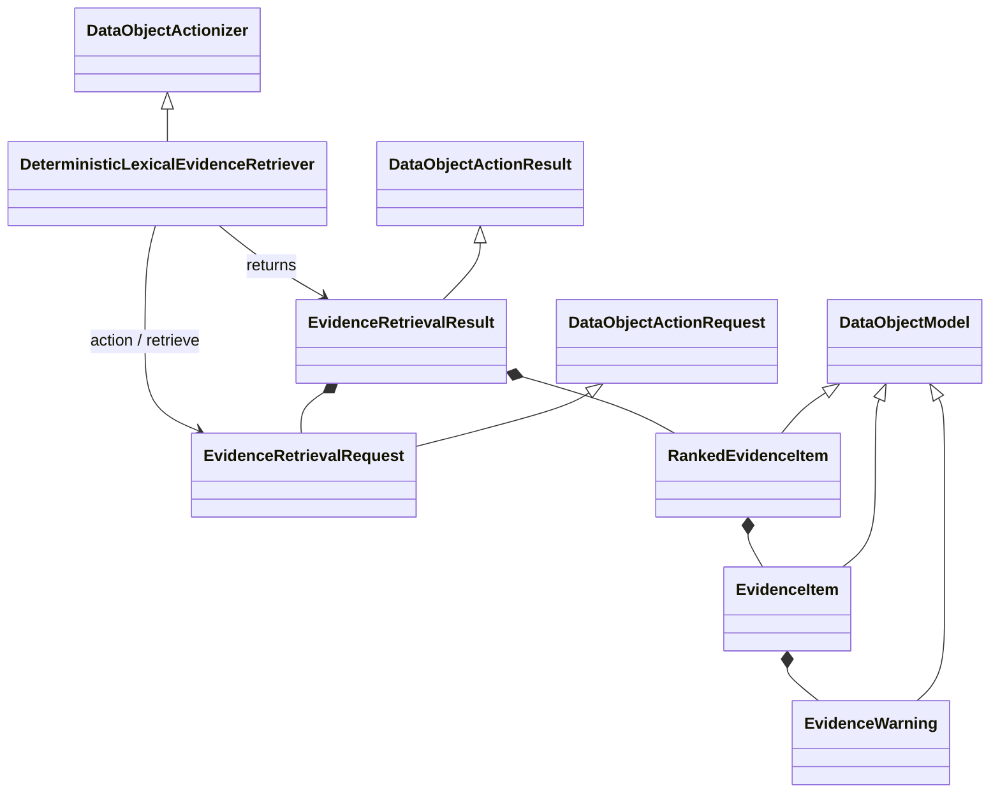

# `evidence_retrieval` schematic

```mermaid
classDiagram
    class DataObjectModel
    class DataObjectActionRequest
    class DataObjectActionResult
    class DataObjectActionizer
    class EvidenceWarning
    class EvidenceItem
    class EvidenceRetrievalRequest
    class RankedEvidenceItem
    class EvidenceRetrievalResult
    class DeterministicLexicalEvidenceRetriever

    DataObjectModel <|-- EvidenceWarning
    DataObjectModel <|-- EvidenceItem
    DataObjectActionRequest <|-- EvidenceRetrievalRequest
    DataObjectModel <|-- RankedEvidenceItem
    DataObjectActionResult <|-- EvidenceRetrievalResult
    DataObjectActionizer <|-- DeterministicLexicalEvidenceRetriever
    EvidenceItem *-- EvidenceWarning
    RankedEvidenceItem *-- EvidenceItem
    EvidenceRetrievalResult *-- EvidenceRetrievalRequest
    EvidenceRetrievalResult *-- RankedEvidenceItem
    DeterministicLexicalEvidenceRetriever --> EvidenceRetrievalRequest : action / retrieve
    DeterministicLexicalEvidenceRetriever --> EvidenceRetrievalResult : returns
```

Every represented value is frozen, slotted, keyword-only, and identity-bearing.
The performer is function-like and is not a DataObject.
