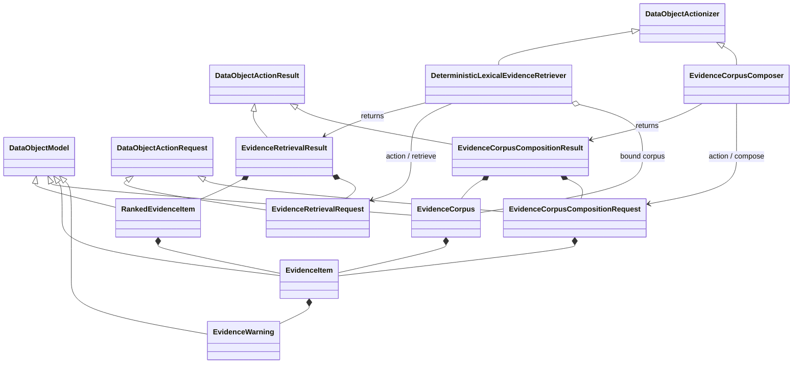

# `evidence_retrieval` schematic

```mermaid
classDiagram
    class DataObjectModel
    class DataObjectActionRequest
    class DataObjectActionResult
    class DataObjectActionizer
    class EvidenceWarning
    class EvidenceItem
    class EvidenceCorpus
    class EvidenceCorpusCompositionRequest
    class EvidenceCorpusCompositionResult
    class EvidenceCorpusComposer
    class EvidenceRetrievalRequest
    class RankedEvidenceItem
    class EvidenceRetrievalResult
    class DeterministicLexicalEvidenceRetriever

    DataObjectModel <|-- EvidenceWarning
    DataObjectModel <|-- EvidenceItem
    DataObjectModel <|-- EvidenceCorpus
    DataObjectActionRequest <|-- EvidenceCorpusCompositionRequest
    DataObjectActionResult <|-- EvidenceCorpusCompositionResult
    DataObjectActionizer <|-- EvidenceCorpusComposer
    DataObjectActionRequest <|-- EvidenceRetrievalRequest
    DataObjectModel <|-- RankedEvidenceItem
    DataObjectActionResult <|-- EvidenceRetrievalResult
    DataObjectActionizer <|-- DeterministicLexicalEvidenceRetriever
    EvidenceItem *-- EvidenceWarning
    EvidenceCorpus *-- EvidenceItem
    EvidenceCorpusCompositionRequest *-- EvidenceItem
    EvidenceCorpusCompositionResult *-- EvidenceCorpusCompositionRequest
    EvidenceCorpusCompositionResult *-- EvidenceCorpus
    EvidenceCorpusComposer --> EvidenceCorpusCompositionRequest : action / compose
    EvidenceCorpusComposer --> EvidenceCorpusCompositionResult : returns
    DeterministicLexicalEvidenceRetriever o-- EvidenceCorpus : bound corpus
    RankedEvidenceItem *-- EvidenceItem
    EvidenceRetrievalResult *-- EvidenceRetrievalRequest
    EvidenceRetrievalResult *-- RankedEvidenceItem
    DeterministicLexicalEvidenceRetriever --> EvidenceRetrievalRequest : action / retrieve
    DeterministicLexicalEvidenceRetriever --> EvidenceRetrievalResult : returns
```

Every represented value is frozen, slotted, keyword-only, and identity-bearing.
The composer and retriever are function-like performers rather than DataObjects.
