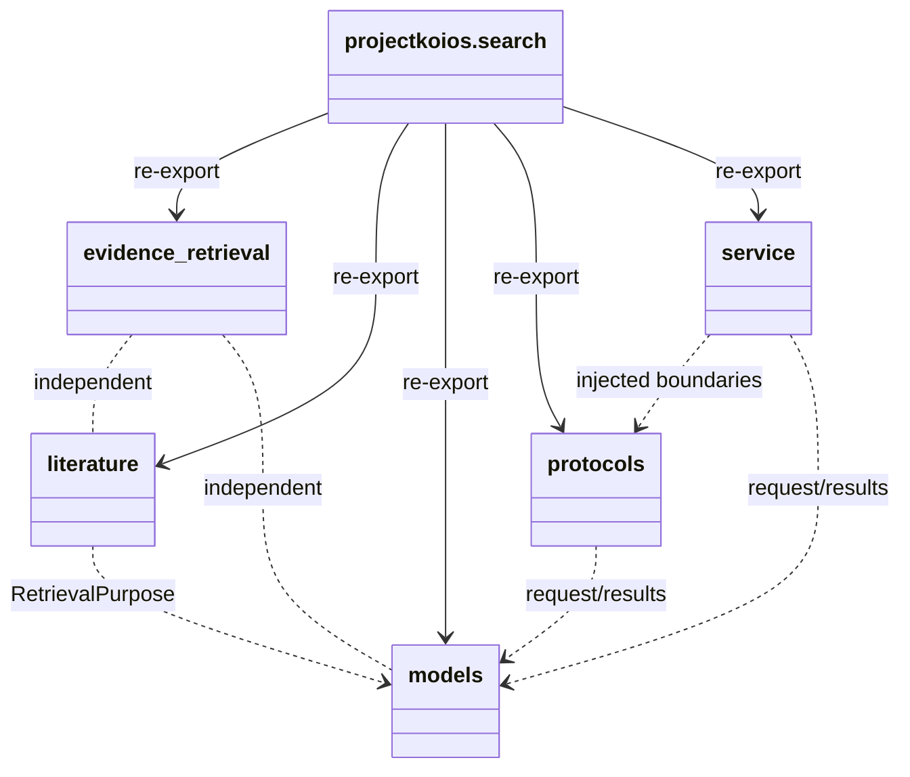

# `projectkoios.search` package implementation

The package initializer re-exports an explicit inventory and keeps all behavior
in named modules. Authoring records import shared ABCs from `projectkoios.base`
and do not import the other search models.

Facade exports preserve each defining module's class identity; the initializer
defines no classes of its own. The package owns no API transport, persistence,
generation, workflow, rights decision, or target-document behavior. Public
implementation classes are documented at exact defining-module paths.
