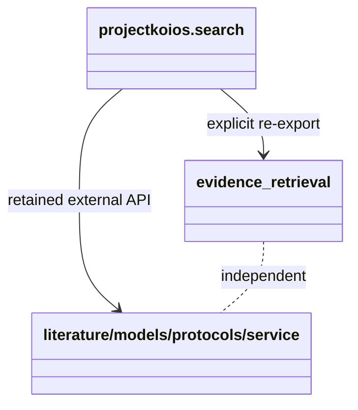

# `projectkoios.search` package implementation

The package initializer re-exports a narrow explicit inventory and keeps all
behavior in named modules. New authoring records import the shared ABCs from
`projectkoios.base` and do not import legacy search models.

The package owns no API, persistence, generation, workflow, rights decision,
or target-document behavior. Public implementation names are documented at
the module and exact class paths.
