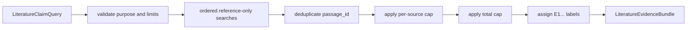

# `literature` implementation

## Bundle selection

`LiteratureEvidenceBundleService.build` accepts only
`RetrievalPurpose.LITERATURE_REVIEW`. For each claim query in order it issues a
reference-only request, then selects results in returned order while removing
repeated passage IDs and enforcing per-source and total limits. Selected items
receive contiguous bundle-local `E1`, `E2`, ... labels.

Claim queries are bounded to 1–8 unique, nonblank strings of at most 2,000
characters. Search-request limits are 1–100. Service limits are 1–12 for each
query and the complete bundle, and 1–2 per source.

## SQLite adapter

`SqliteFtsReferenceEvidenceIndex` rejects symlinks and requires an existing
regular database file. Construction checks for `documents`, `passages`, and
`passages_fts` plus a successful SQLite integrity check. Connections use URI
read-only mode and `PRAGMA query_only = ON`.

Search accepts only literature-review/reference requests. It converts unique
Unicode word terms to an FTS OR expression, queries only rows whose document
role is `reference`, uses negated FTS5 `bm25` as the exposed score, orders ties
by passage ID, and returns at most one passage per source. Empty lexical
expressions return no results.
