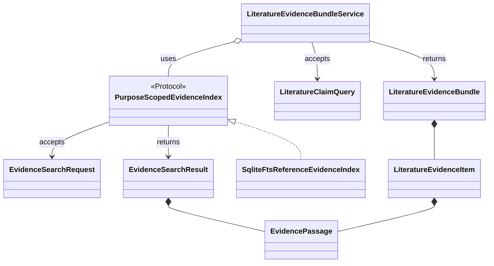

# `literature` schematic

```mermaid
classDiagram
    class PurposeScopedEvidenceIndex {
        <<Protocol>>
    }
    class EvidenceSearchRequest
    class EvidenceSearchResult
    class EvidencePassage
    class LiteratureClaimQuery
    class LiteratureEvidenceItem
    class LiteratureEvidenceBundle
    class LiteratureEvidenceBundleService
    class SqliteFtsReferenceEvidenceIndex

    PurposeScopedEvidenceIndex --> EvidenceSearchRequest : accepts
    PurposeScopedEvidenceIndex --> EvidenceSearchResult : returns
    EvidenceSearchResult *-- EvidencePassage
    LiteratureEvidenceBundleService o-- PurposeScopedEvidenceIndex : uses
    LiteratureEvidenceBundleService --> LiteratureClaimQuery : accepts
    LiteratureEvidenceBundleService --> LiteratureEvidenceBundle : returns
    LiteratureEvidenceBundle *-- LiteratureEvidenceItem
    LiteratureEvidenceItem *-- EvidencePassage
    PurposeScopedEvidenceIndex <|.. SqliteFtsReferenceEvidenceIndex
```

The service is index-agnostic through the protocol; the SQLite class is one
read-only implementation of that boundary.
