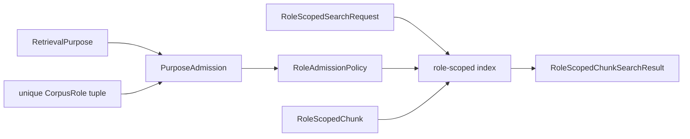

# `models` implementation

The module uses frozen dataclasses for result, policy, record, and request
values, and `StrEnum` for purpose and corpus role. It does not add persistence
or deterministic content identities.

`PurposeAdmission` requires an explicit purpose and a nonempty unique tuple of
explicit roles. `RoleAdmissionPolicy` requires explicit entries with unique
purposes; lookup returns the configured roles or raises
`UnsupportedRetrievalPurposeError`. `RoleScopedChunk` requires a nonempty
record ID, explicit role, and unique explicit purposes. `RoleScopedSearchRequest`
requires a nonblank query, explicit purpose, unique exclusions, and a positive
limit.

`course_material_admission_policy()` fixes the implemented matrix:

| Purpose | Admitted corpus roles |
|---|---|
| `PROBLEM_SOLVING` | `THEORY_EVIDENCE` |
| `LECTURE_AUTHORING` | `THEORY_EVIDENCE`, `SOURCE_WORKED_EXAMPLE`, `REVIEWED_SOLUTION` |
| `CITATION_EVIDENCE` | `THEORY_EVIDENCE` |
| `ORDINARY_RAG` | `THEORY_EVIDENCE` |

`LITERATURE_REVIEW` is intentionally absent and therefore fails closed through
this policy.
