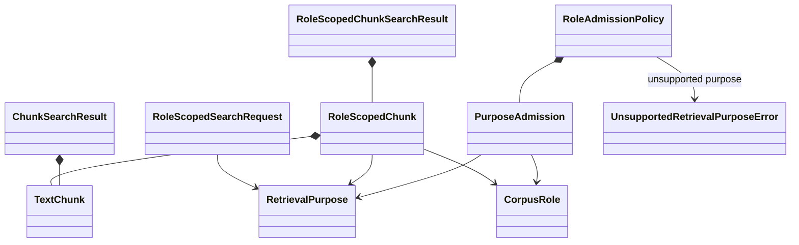

# `models` schematic

```mermaid
classDiagram
    class TextChunk
    class ChunkSearchResult
    class RetrievalPurpose
    class CorpusRole
    class PurposeAdmission
    class RoleAdmissionPolicy
    class RoleScopedChunk
    class RoleScopedSearchRequest
    class RoleScopedChunkSearchResult
    class UnsupportedRetrievalPurposeError

    ChunkSearchResult *-- TextChunk
    PurposeAdmission --> RetrievalPurpose
    PurposeAdmission --> CorpusRole
    RoleAdmissionPolicy *-- PurposeAdmission
    RoleAdmissionPolicy --> UnsupportedRetrievalPurposeError : unsupported purpose
    RoleScopedChunk *-- TextChunk
    RoleScopedChunk --> CorpusRole
    RoleScopedChunk --> RetrievalPurpose
    RoleScopedSearchRequest --> RetrievalPurpose
    RoleScopedChunkSearchResult *-- RoleScopedChunk
```

The request declares purpose; the policy admits roles; and each indexed record
separately declares its admitted purposes.
