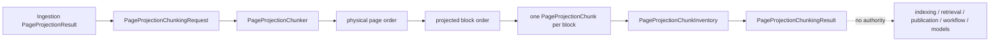

# `page_projection_chunking` schematic

```mermaid
flowchart LR
    Input["Ingestion PageProjectionResult"] --> Request["PageProjectionChunkingRequest"]
    Request --> Chunker["PageProjectionChunker"]
    Chunker --> Pages["physical page order"]
    Pages --> Blocks["projected block order"]
    Blocks --> Chunk["one PageProjectionChunk per block"]
    Chunk --> Inventory["PageProjectionChunkInventory"]
    Inventory --> Result["PageProjectionChunkingResult"]
    Result -. "no authority" .-> Excluded["indexing / retrieval / publication / workflow / models"]
```

The solid path is synchronous and side-effect free. The dotted edge identifies
capabilities that the result does not grant.
