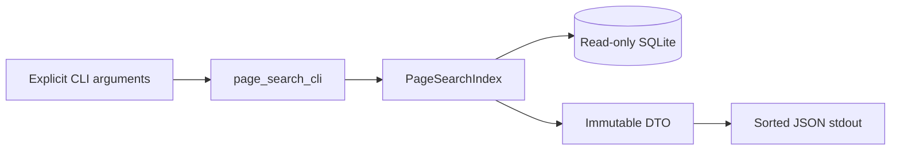

# Page-search CLI schematic

```mermaid
flowchart LR
    O[Explicit CLI arguments] --> C[page_search_cli]
    C --> P[PageSearchIndex]
    P --> D[(Read-only SQLite)]
    P --> R[Immutable DTO]
    R --> J[Sorted JSON stdout]
```

The adapter has no build, transcript-loading, publication-loading, or mutation
route.
