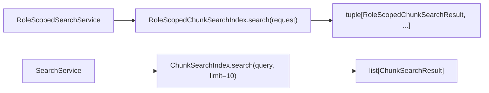

# `protocols` implementation

Both interfaces are `typing.Protocol` classes and rely on structural typing.
Neither is runtime-checkable and neither supplies default behavior.

The role-scoped protocol preserves the complete request object and immutable
tuple result boundary. The unscoped protocol accepts a query plus keyword-only
limit and returns a mutable list, matching the existing prototype API.
