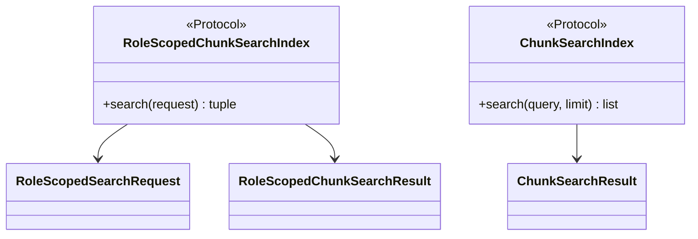

# `protocols` schematic

```mermaid
classDiagram
    class RoleScopedChunkSearchIndex {
        <<Protocol>>
        +search(request) tuple
    }
    class ChunkSearchIndex {
        <<Protocol>>
        +search(query, limit) list
    }
    class RoleScopedSearchRequest
    class RoleScopedChunkSearchResult
    class ChunkSearchResult

    RoleScopedChunkSearchIndex --> RoleScopedSearchRequest
    RoleScopedChunkSearchIndex --> RoleScopedChunkSearchResult
    ChunkSearchIndex --> ChunkSearchResult
```

The protocols separate service delegation from concrete in-memory or persistent
index implementations.
