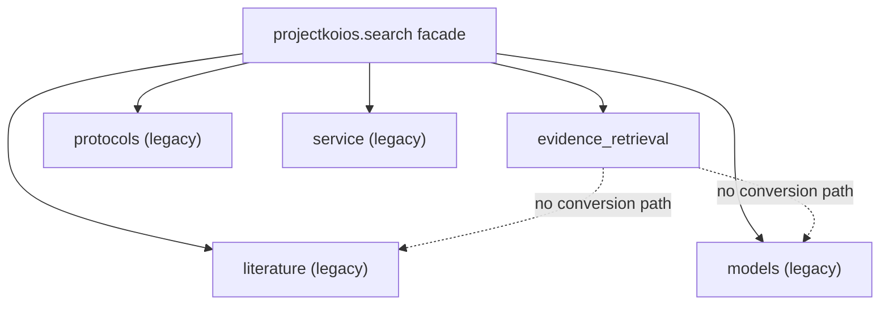

# `projectkoios.search` package schematic

```mermaid
flowchart TB
    Facade["projectkoios.search facade"] --> Evidence["evidence_retrieval"]
    Facade --> Literature["literature (legacy)"]
    Facade --> Models["models (legacy)"]
    Facade --> Protocols["protocols (legacy)"]
    Facade --> Service["service (legacy)"]
    Evidence -. "no conversion path" .-> Literature
    Evidence -. "no conversion path" .-> Models
```

The dotted relationships are explicit non-integration boundaries. The new
family neither wraps nor silently converts legacy records.
