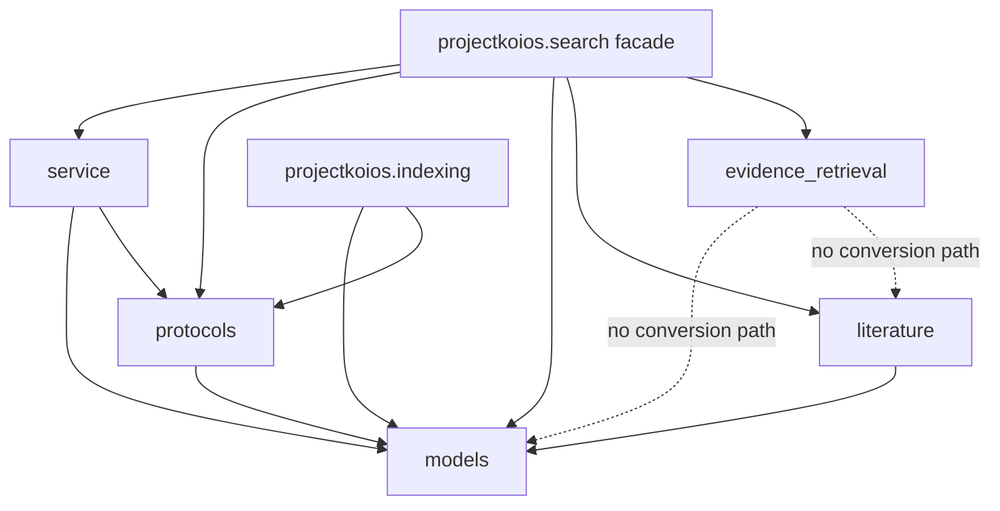

# `projectkoios.search` package schematic

Solid arrows represent imports or facade exports. Dotted relationships are
explicit non-integration boundaries: the authoring family neither wraps nor
silently converts the other prototype records.
