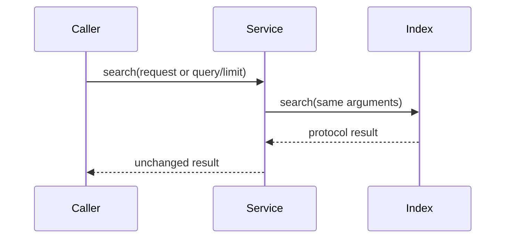

# `service` implementation

Construction stores the injected index as a public `search_index` attribute.
Both search methods immediately return the corresponding index call.

`RoleScopedSearchService` forwards the exact `RoleScopedSearchRequest` and
returns the index's tuple. `SearchService` forwards `query` and keyword-only
`limit` and returns the index's list. Errors raised by an index propagate.
