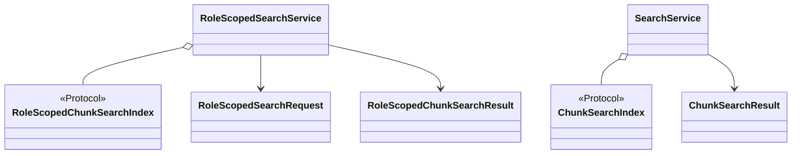

# `service` schematic

```mermaid
classDiagram
    class RoleScopedSearchService
    class SearchService
    class RoleScopedChunkSearchIndex {
        <<Protocol>>
    }
    class ChunkSearchIndex {
        <<Protocol>>
    }
    class RoleScopedSearchRequest
    class RoleScopedChunkSearchResult
    class ChunkSearchResult

    RoleScopedSearchService o-- RoleScopedChunkSearchIndex
    RoleScopedSearchService --> RoleScopedSearchRequest
    RoleScopedSearchService --> RoleScopedChunkSearchResult
    SearchService o-- ChunkSearchIndex
    SearchService --> ChunkSearchResult
```

Services preserve the return collection type defined by the injected protocol.
